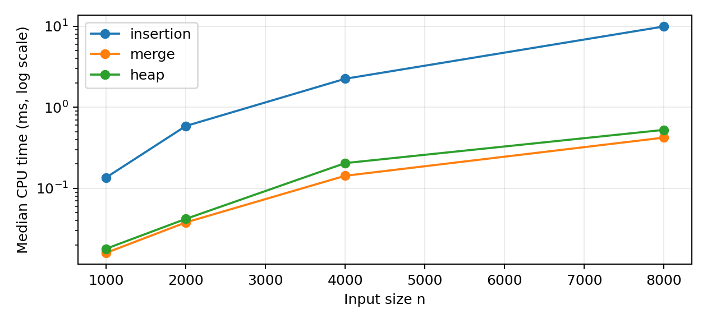

# 삽입·병합·힙 정렬 비교 보고서

이름: 신재욱    학번: [입력 필요]    작성일: 2026. 09. 30.

GitHub 저장소 URL: https://github.com/tlswodnr07/programing

## 1. 비교 목적과 구현 구성

수업에서 배운 삽입 정렬과 병합 정렬, 새로 학습한 힙 정렬을 비교한다. 정렬 속도만 비교하면 입력의 특성이나 메모리 사용 차이를 놓칠 수 있으므로 실행 시간, key 비교 횟수, 이동 횟수, 추가 버퍼와 안정성을 함께 살펴보았다.

삽입 정렬은 구현이 단순하고 정렬된 입력을 빠르게 처리한다. 병합 정렬은 입력을 나누고 정렬된 구간을 합친다. 힙 정렬은 배열 안에 최대 힙을 만들어 가장 큰 원소를 뒤쪽에 배치한다. 세 알고리즘은 서로 다른 방식으로 시간과 메모리를 사용하므로 비교 대상으로 선정했다.

| 파일 | 내용 |
| --- | --- |
| src/sort.c · sort.h | C 정렬 구현과 공통 인터페이스 |
| src/sort.py | 같은 절차의 Python 정렬 구현 |
| src/main.c · main.py | 동일 입력 생성과 공통 측정 |
| tests/ | C·Python 정답 및 안정성 검사 |
| Makefile | make test / make run / make clean |
| report/results.csv | 총 60조건의 실측 원본 |
| report/growth.png | 무작위 입력의 크기별 시간 그래프 |
| README.md | 실행 방법과 제출 순서 |

공통 자료형은 Item { int key, tag; }이다. key로만 비교하고 tag에는 입력 순서를 저장한다. 같은 key의 tag 순서가 뒤집히는지를 검사하여 안정성을 관찰한다. 함수 포인터 목록으로 같은 측정 코드를 세 정렬에 적용했다. 표준 qsort는 정답 확인에만 사용했다.

사용자 저장소의 src/·tests/·Makefile과 컨테이너·VS Code 설정을 유지하고 예제 코드를 과제 코드로 교체했다. C17과 Python 표준 모듈로 같은 알고리즘을 구현했으며 결과는 직접 실행하여 측정했다.

---

## 2. 배운 정렬: 삽입 정렬과 병합 정렬

## 2.1 삽입 정렬

앞부분을 정렬된 상태로 유지하면서 다음 원소를 알맞은 위치에 삽입한다. 현재 값보다 큰 원소들을 한 칸씩 오른쪽으로 밀고, 빈 위치에 현재 값을 쓴다. 같은 값은 밀지 않으므로 입력 순서를 유지한다.

예: [5, 2, 4, 1] → [2, 5, 4, 1] → [2, 4, 5, 1] → [1, 2, 4, 5]. 반복문 시작 때 앞쪽 구간이 정렬되어 있고, 한 원소를 삽입하면 정렬된 구간이 한 칸 길어진다. 이를 반복하여 전체를 정렬한다.

정렬된 입력은 각 원소가 이미 제자리에 있으므로 비교가 n-1회이며 시간은 O(n)이다. 역순에서는 i번째 원소가 앞쪽 i개 원소를 모두 지나야 하므로 비교 합계는 n(n-1)/2이다. 평균·최악 시간은 O(n²), 추가 공간은 O(1)이다. 현재 구현은 원소를 임시 변수에 복사하고 제자리에 다시 저장하므로 정렬된 입력에서도 이동이 2(n-1)회 발생한다. [1]

## 2.2 병합 정렬

구간을 반으로 나누어 각각 정렬한 뒤, 두 구간의 앞부분을 비교하면서 작은 값을 임시 배열에 넣는다. 두 값이 같으면 왼쪽 구간의 원소를 먼저 선택하여 안정성을 유지한다. 합친 결과를 원래 배열에 복사한다.

예: [5, 2, 4, 1]을 [5, 2]와 [4, 1]로 나누고 각각 [2, 5], [1, 4]로 정렬한다. 두 구간을 병합하면 [1, 2, 4, 5]가 된다. 각각 정렬된 구간의 가장 작은 미사용 원소부터 선택하므로 병합 결과도 정렬된다.

분할 깊이는 O(log n), 각 깊이에서 병합하는 원소 수의 합은 O(n)이므로 시간은 O(n log n)이다. 본 구현은 이미 정렬된 구간을 건너뛰는 최적화를 넣지 않아 최선·평균·최악 모두 O(n log n)이다. 길이 n인 버퍼를 한 번 할당해 재사용하며, O(log n) 재귀 스택도 필요하다. 전체 추가 공간은 O(n)이다. [2]

---

## 3. 새로 학습한 정렬: 힙 정렬

## 3.1 AI를 통해 학습한 내용

AI(ChatGPT)의 설명을 통해 최대 힙의 구조, 배열 인덱스 관계, sink의 역할, 시간·공간 복잡도와 안정성을 학습할 수 있도록 정리했다. 설명은 교재 저자의 공개 자료로 확인했으며 아래에 학습 내용을 첨부한다. 힙 정렬은 과제 안내의 수업 정렬 목록에 없으므로 새로 학습한 정렬로 선택했다. [3]

최대 힙은 부모의 값이 자식의 값보다 크거나 같은 완전이진트리이다. 모든 원소가 완전히 정렬되어 있는 것은 아니지만 루트에는 최댓값이 있다. 인덱스를 0부터 세는 배열에서 왼쪽 자식은 2i+1, 오른쪽 자식은 2i+2이며, 마지막 내부 노드는 n/2-1이다.

sink는 부모를 두 자식 중 더 큰 값과 비교하여 필요하면 교환하고 아래로 내려가는 과정이다. 마지막 내부 노드부터 루트까지 sink를 적용하면 최대 힙이 만들어진다. 이때 두 자식의 부분 트리가 먼저 힙이 되므로 부모까지 복구할 수 있다.

## 3.2 정렬 과정과 작은 예시

| 단계 | 배열 / 정렬 완료 구간 |
| --- | --- |
| 입력 | [4, 1, 3, 2] |
| 최대 힙 구성 | [4, 2, 3, 1] |
| 최댓값 4 확정 후 복구 | [3, 2, 1 | 4] |
| 최댓값 3 확정 후 복구 | [2, 1 | 3, 4] |
| 마지막 교환 | [1 | 2, 3, 4] |

루트와 힙의 마지막 원소를 교환하고 힙 범위를 한 칸 줄인다. 루트에서 sink를 수행한 다음 같은 작업을 반복한다. 뒤쪽에는 큰 원소부터 확정되고 앞쪽에는 아직 정렬할 최대 힙이 유지되므로 마지막에는 오름차순 배열이 된다.

아래에서 위로 만드는 힙 구성은 O(n)이다. 각 노드의 높이를 고려하면, 높이가 큰 노드는 적기 때문이다. 최댓값을 꺼내고 복구하는 작업은 한 번에 O(log n), 이를 반복하므로 평균·최악 시간은 O(n log n)이다. 반복문으로 구현한 본 코드는 추가 공간 O(1)이다. [3]

힙 정렬은 안정 정렬이 아니다. 예를 들어 모두 같은 key라도 루트와 마지막 원소를 교환하면서 tag 순서가 바뀔 수 있다. 메모리를 적게 쓰면서 최악 시간 상한을 보장하는 장점이 있지만, 동일 값의 기존 순서를 보존해야 하는 작업에는 그대로 사용할 수 없다.

---

## 4. 실험 조건과 이론 비교

| 항목 | 조건 |
| --- | --- |
| 환경 | Linux x86_64, GCC 13.3.0, C17, -Wall -Wextra -O2 |
| 입력 크기 | 1,000 / 2,000 / 4,000 / 8,000 |
| 입력 종류 | 무작위, 오름차순, 역순, 0~9 중복, 모두 같은 값 |
| 입력 생성 | xorshift32, 시드 20260930+n; 정렬마다 같은 원본 복사 |
| 시간 측정 | C clock() / Python process_time(); 1회 준비 + 5회 중앙값 |
| 측정 범위 | 정렬 호출만; 병합 버퍼 할당·해제 포함; 복사·검증 제외 |
| 정답 검증 | 정렬한 key 배열이 qsort 결과와 같은지 검사 |

비교 횟수는 key 사이의 비교만 센다. 이동은 원소를 임시 변수·원래 배열·병합 버퍼에 저장하는 동작이다. 강의 주제 02의 기준에 따라 교환 한 번을 이동 3회로 센다. Python의 튜플 교환도 같은 추상적 이동 3회로 집계하며, 객체 생성 자체는 별도로 세지 않는다. 시간은 CPU 시간을 측정한다.

| 정렬 | 최선 시간 | 평균 / 최악 | 추가 공간 | 안정 |
| --- | --- | --- | --- | --- |
| 삽입 | O(n) | O(n²) / O(n²) | O(1) | 예 |
| 병합 | O(n log n) | O(n log n) / O(n log n) | O(n) | 예 |
| 힙 | O(n)* | O(n log n) / O(n log n) | O(1) | 아니오 |

* 본 sink 구현은 동일한 값을 만나면 즉시 멈춘다. 따라서 모두 같은 key의 입력에서는 힙 정렬도 O(n)으로 종료한다. 서로 다른 key를 가정하는 일반 비교표의 최선 O(n log n)과 전제가 다르다. [3]

buffer_bytes는 정렬 전용 동적 버퍼만 집계한다. n=8,000에서 병합 버퍼는 sizeof(Item)=8인 실행 환경 기준 64,000바이트이고, 삽입·힙은 0이다. 0이라는 값은 메모리를 전혀 쓰지 않는다는 뜻이 아니다. 지역 변수, 병합 재귀 스택, 실험용 공통 배열은 해당 열에서 제외했다.

빈 배열부터 길이 200까지, 5종류 입력 × 3정렬을 검사하여 총 3,015건이 통과했다. 삽입·병합에는 tag 안정성도 검사했다. Python도 같은 3,015조건을 검사하고 힙 정렬의 불안정성 반례를 추가 검사했다. C·Python 실험의 비교·이동 횟수는 총 60조건에서 모두 일치했다. C ASan/UBSan 검사도 통과했으며 컨테이너 제한으로 누수 검사는 제외했다.

---

## 5. 실제 측정 결과

다음은 n=8,000에서 측정한 시간의 중앙값이다. 단위는 ms이며 측정 당시 컨테이너 환경의 결과이다.

| 입력 | 삽입 (ms) | 병합 (ms) | 힙 (ms) |
| --- | --- | --- | --- |
| 무작위 | 9.9500 | 0.4230 | 0.5270 |
| 오름차순 | 0.0080 | 0.1120 | 0.3390 |
| 역순 | 18.3530 | 0.1140 | 0.3630 |
| 중복 0~9 | 8.6610 | 0.2550 | 0.3990 |
| 모두 같음 | 0.0090 | 0.1130 | 0.0320 |

| n (무작위) | 삽입 비교 | 병합 비교 | 힙 비교 |
| --- | --- | --- | --- |
| 1,000 | 237,238 | 8,698 | 16,864 |
| 2,000 | 1,011,068 | 19,372 | 37,712 |
| 4,000 | 4,037,985 | 42,806 | 83,357 |
| 8,000 | 15,922,428 | 93,590 | 182,854 |

시간 그래프의 세로축은 로그 축이다. 작은 시간도 비교할 수 있지만 선 사이 간격이 실제 시간 차이를 그대로 나타내지는 않는다. 무작위 입력에서 삽입 정렬의 비교 횟수는 n을 두 배로 늘릴 때 약 네 배가 되고, 병합·힙은 약 두 배보다 조금 더 증가한다. 이는 O(n²)와 O(n log n)의 이론적 증가 경향과 맞는다.

---

## 6. 결과 해석, 한계와 결론

| 무작위 8,000개 | C 시간 (ms) | Python 시간 (ms) |
| --- | --- | --- |
| insertion | 9.9500 | 3193.7578 |
| merge | 0.4230 | 33.1738 |
| heap | 0.5270 | 37.6751 |

무작위 8,000개에서 삽입 정렬은 병합 정렬보다 약 23.5배, 힙 정렬보다 약 18.9배 오래 걸렸다. 삽입 정렬은 많은 원소를 밀어야 하고, 병합·힙은 비교 횟수의 증가가 완만하기 때문이다. 두 O(n log n) 알고리즘도 상수 비용과 메모리 접근 방식이 달라 시간이 같지는 않다.

오름차순 입력에서는 삽입 정렬이 7,999회 비교로 끝나 가장 빨랐다. 역순 입력에서는 31,996,000회 비교가 발생했는데, 이는 8,000×7,999/2와 일치한다. 이 결과는 입력의 정렬 상태가 삽입 정렬의 성능을 크게 좌우한다는 점을 보여 준다.

| 정렬 / 무작위 n=8,000 | key 비교 | 이동 | 추가 버퍼 |
| --- | --- | --- | --- |
| insertion | 15,922,428 | 15,930,438 | 0 B |
| merge | 93,590 | 207,616 | 64,000 B |
| heap | 182,854 | 289,998 | 0 B |

중복 입력과 모두 같은 값에서 삽입·병합은 tag 순서를 보존했고 힙은 위반이 관찰되었다. 반대로 중복이 없는 오름차순·역순 입력에서는 힙도 stable_observed=1이지만, 같은 key 쌍이 없어 검사가 위반을 찾을 수 없었을 뿐이다. 한 번의 관찰 결과와 알고리즘의 안정성 보장은 구분해야 한다.

한계: 시간은 한 환경에서, 크기별·유형별 하나의 고정 입력을 반복하여 측정했다. 본문의 시간 표와 그래프는 C 결과이며 Python 전체 결과는 report/results_python.csv에 첨부했다. 5회 중앙값은 반복 실행의 흔들림을 줄이지만 입력 분포의 평균 성능을 추정하지는 않는다. 평균 복잡도는 이론으로 제시한 것이며 더 강한 실험 결론에는 여러 시드와 더 큰 입력이 필요하다. 계수 집계도 측정 시간에 포함되어 있고 실제 응용의 비교 비용은 다를 수 있다.

결론: 작거나 이미 많이 정렬된 데이터에는 삽입 정렬이 적합하다. 큰 입력에서 안정성이 필요하고 추가 메모리가 허용된다면 병합 정렬이 유리하다. 동일 값의 순서 보존이 필수가 아니며 메모리를 적게 사용하면서 최악 시간 상한을 유지해야 한다면 힙 정렬을 선택할 수 있다. 이번 실험의 최저 시간만으로 모든 상황의 최적 정렬을 단정할 수는 없다.

## 참고 자료 및 AI 활용

[1] Sedgewick & Wayne, Algorithms 4e, Elementary Sorts. https://algs4.cs.princeton.edu/21elementary/

[2] Sedgewick & Wayne, Algorithms 4e, Mergesort. https://algs4.cs.princeton.edu/22mergesort/

[3] Sedgewick & Wayne, Algorithms 4e, Priority Queues / Heapsort. https://algs4.cs.princeton.edu/24pq/

[6] 이태규, 고급알고리즘 주제 00·02·03·04 강의자료(제공 PDF). 이동 기준 및 수업 정렬 확인.

[4] 교수자 샘플: https://github.com/lec-algorithm/hw1-sample-2026 (구성과 측정 방식 참고)

[5] 과제 안내의 Wikipedia Sorting algorithm 비교표: https://en.wikipedia.org/wiki/Sorting_algorithm#Comparison_of_algorithms

자료 확인일: 2026. 09. 30. ChatGPT로 힙 정렬 학습, 코드·보고서 초안 작성 및 검증을 보조했다.
